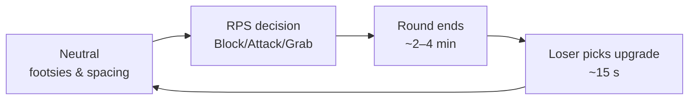
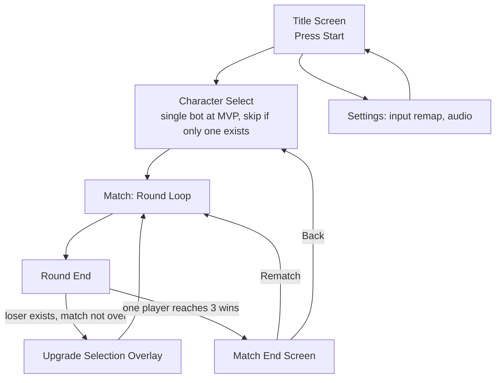

# The Creature's Features: Game Design Document

*(working title, formerly "Build 'Em, Beat 'Em Bots")*

|||
|-|-|
|**Team**|Unpitched, solo dev currently|
|**Members & roles**|@leo (design lead, programmer) · unassigned, need: upgrade system programmer · unassigned, need: online multiplayer programmer · unassigned, need: animator|
|**Engine / platform**|Godot 4.7 / PC (Windows)|
|**Repo**|[link]|
|**Doc version**|v1.1|
|**Last updated**|2026-07-20|

# 1. Page One: The Core

## 1.1 Hook

For people who like the *idea* of fighting games but get discouraged getting outplayed by better players, **The Creature's Features** is a local-multiplayer 2D fighting game where losing makes you stronger. Two goofy, smiling creatures fight best-of-five. Every round you lose, you pick **two** things: a **Creature** (a permanent stat upgrade, move speed, health, gravity, etc., named after the creature type it evokes) and a **Feature** (either unlocking a new special move input, or upgrading a special move you've already unlocked). No motion inputs, no combos to memorize. 

## 1.2 Design pillars

|Pillar|What it means|Consequences (what it forbids/forces)|
|-|-|-|
|1. **Fair**|Every action has a clear cause the opponent could have played around differently. If you got hit, you could have blocked, spaced, or read it.|Forbids: upgrades or moves with no counterplay (true unblockables, undodgeable projectiles, unreactable overheads/lows below a readable frame floor). Forces: every new special property must name what beats it before it ships.|
|2. **Simple**|The game stays inside its existing core loop. No new systems bolted on.|Forbids: meters, resource bars, currencies, cooldown UIs, or any mechanic that needs its own HUD element or its own explanation screen. Forces: every upgrade either modifies an existing verb/stat or extends the existing RPS triangle, it cannot introduce a fourth option.|
|3. **Synergy**|Upgrades and moves should combine, so a player's build feels like a discovered playstyle, not a pile of separately-strong stats.|Forbids: upgrade pools where picks are purely additive and interchangeable (a damage buff that does nothing but "be bigger"). Forces: each property upgrade should read differently depending on which other upgrades and moves are already in play (e.g. a projectile split property matters more once movement speed is up).|

## 1.3 Core loop

* **Moment loop (seconds):** Block beats Attack, Attack beats Grab, Grab beats Block. Every exchange is a read.
* **Session loop (minutes):** One round runs roughly 2–4 minutes depending on skill gap. A full best-of-5 match runs **10–20 minutes**.
* **Meta loop (a match):** Losses compound into a customized build. Round 1 is the base creature; round 5 can be unrecognizable. The winner has to keep re-reading a moving target.

## 1.4 Audience & genre

**Primary:** people who like the idea of fighting games but bounce off getting outplayed by better players before they've learned anything, they want the fantasy without the beatdown.
**Secondary:** experienced fighting-game players looking for a low-execution party game with real strategic depth.
**Tertiary:** two people sharing one keyboard who want something competitive right now, no setup.

Comparison games:

* **"Generic fighter maybe"**, take: our main inspiration for keeping this a very simple 2D fighter, minimal moveset, minimal systems, low barrier to entry. Reject: combo heavy gameplay.
* **Rounds (Landfall)**, take: our main inspiration for the core loop, a roguelike-style upgrade pick after every round lost, which is exactly where the Creature/Feature system comes from. Reject: Rounds is a free-for-all shooter; we're keeping the RPS-based melee fighter structure instead.
* **Fantasy Strike**, take: no motion inputs, reactable everything. Reject: still assumes a matchup-knowledge skill floor we want to erase via the upgrade catch-up.
* **Mario Kart**, take: rubber-banding that keeps a losing player engaged and dangerous. Reject: randomness as pure luck; our upgrades are randomized *options* but the pick is always a real decision.
* **Divekick**, take: radical input minimalism. Reject: too shallow long-term; our depth lives in the upgrade tree, not added buttons.

## 1.5 Look, feel, and tone, in one paragraph

Two smiling, goofy creatures drawn like a talented teenager's 2003 MS Paint sketchbook, black outlines, white fill, a handful of accent colors, animation that reads as deliberately janky and absurd rather than polished. Attacks are silly and expressive, not menacing. Backdrops lean surrealist/absurdist, Dalí and Escher-style impossible landscapes rather than a literal location. It should feel friendly, weird, and underdog, never sleek or corporate. Full direction in §9.

## 1.6 Scope: goals and non-goals

### Non-goals

* No motion inputs or command-grab-style execution, every special is direction + button.
* No second playable character at MVP, mirror matches only, ship depth over breadth. **ONE CHARACTER AT LAUNCH.**
* No stage hazards, destructible terrain, or ring-outs, pure clean combat space.
* No meters, cooldown bars, or resource systems of any kind (Pillar 2: Simple).
* No okizeme / wake-up pressure, knockdown is a damage-and-reset tool, not a pressure tool, by design.
* No story mode or narrative progression, see §4.
* No microtransactions or gameplay-affecting purchases if the game is ever monetized further.

### MoSCoW scope table

|Feature|Priority|Milestone|Owner|Status|
|-|-|-|-|-|
|Core RPS loop (Block/Attack/Grab)|Must|Vertical slice||not started|
|Full default moveset (11 moves, frame data)|Must|Vertical slice||not started|
|Upgrade system (selection, application, slot-locking)|Must|Vertical slice||not started|
|Round/match flow (best-of-5, win tracking)|Must|Vertical slice||not started|
|Shared-keyboard + controller input|Must|First playable||not started|
|One creature fully animated|Should|First playable||not started|
|Upgrade selection UI art|Should|First playable||not started|
|One stage (surrealist backdrop)|Should|First playable||not started|
|Full "stat upgrade + special property" pool|Should|Content complete||not started|
|SFX + music|Should|Content complete||not started|
|Frame data balance pass|Should|Polish||not started|
|Second creature character|Could|Post-launch||not started|
|Additional stages|Could|Post-launch||not started|
|Simple CPU/Arcade mode|NOPE|never||not started|
|Online lobbies / rollback netcode|maybbeeee (this project phase)|n/a||not started|

---

# 2. Gameplay & Mechanics

## 2.1 Player verbs & controls

**Move notation:**  Numpad reference: **5** = neutral/no direction, **6** = forward, **4** = back, **8** = up (unrelated to the Jump button, see below), **2** = down. Move prefix denotes the button: **n** = Normal (attack button), **s** = Special (special button). So `n5` = neutral normal (no direction + attack), `n6` = forward normal, `s4` = back special, etc. Jumping attacks use `a` in place of the ground numpad digit, `na` = neutral aerial. **Forward/back are fixed per player, not relative to facing.** Since there are no cross-ups and players never swap sides (§2.3), Player 1 is always the left-side player and their forward is always screen-right; Player 2 is always the right-side player and their forward is always screen-left. `n6` always means "the input that pushes this player toward their opponent's starting side," There are exactly seven buttons/inputs in the whole game: four movement directions, Attack, Special, and Jump. Up is a movement/stance direction only. It does not jump; Jump is its own dedicated button.

|Verb|Input (single-player dev build)|Timing / numbers|Notes|
|-|-|-|-|
|Move (4 directions)|WASD|max speed TBD, ground-only||
|Jump|Space|evades lows only, cannot block airborne; separate from the Up direction||
|Attack (n5/n6/n4/n2/n8 grounded, `na` airborne)|I |see §2.5 frame table|direction determines which normal fires|
|Special (s5/s6/s4/s2/s8 grounded, `sa` airborne)|O |see §2.5 frame table|direction determines which special fires; only `s5` (neutral special) is available from the start, all other specials are locked behind Feature unlocks, see §2.2.2|
|Grab|Attack+Special simultaneous|6f startup|deliberate two-button input, beats block, loses to attack. standing only|
|Block|Hold Back|high block stops mid/overhead, low block (hold Back while crouching) stops low/mid|cannot block airborne|

Two-player local input mapping is still TBD. The WASD/Space/I/O scheme above is a solo-dev testing convenience, not the final P1/P2 layout. Full control mapping (shared keyboard, controller) in §7.

## 2.2 Systems & rules (the model of the world)

### 2.2.1 RPS combat triangle

* **Intent:** Pillar 1 (Fair), every hit has a legible counter.
* **Rules:** Block beats Attack. Attack beats Grab. Grab beats Block. Overheads must be blocked standing; lows must be blocked crouching; blocking the wrong stance is a hit.
* **Edge cases:** What if the player just holds Block the whole match? They lose to Grab every time. The triangle has no dominant strategy. What if they never block? They lose to any Attack in neutral. This closure is the point.

### 2.2.2 Upgrade system: Creature and Feature picks

* **Intent:** Pillars 1, 2, 3, every upgrade must be reactable/counterable, must not introduce a new system, and should combine with existing kit. This is also where the game's name comes from: every round loss earns a **Creature** and a **Feature**.
* **Base kit:** all five normals (n5/n6/n4/n2/n8) plus the neutral special (s5) are available from the start. The other four specials, `s6` (forward), `s4` (back), `s2` (down), `s8` (up), start **locked** and can only be gained via Feature picks.
* **Rules:** On round loss, the losing player picks **two** things:

  1. **Creature**, a stat-buff upgrade (move speed, health, gravity, etc.), randomly drawn from 3-4 options, named after the creature type it evokes. Stacks indefinitely, same as before.
  2. **Feature**, drawn from whichever of these are still available: (a) unlock a currently-locked special (gain its input), or (b) upgrade a special that's already been unlocked (e.g. make `s6` cancelable into Grab). Early in a match, before any specials are unlocked, Feature options are unlock-only. Once at least one special is unlocked, Feature options can be a mix of "unlock a different special" and "upgrade a special you already have."
* **Edge cases:** What if a player never loses a round? They never get a Creature or Feature pick. They stay on base kit the whole match, by design. What if all four unlockable specials are already unlocked *and* fully upgraded, so the Feature pool would offer nothing? Falls back to Creature-only picks that round (pool code needs this fallback explicitly, see §4.3). Conversely, if the Creature stat pool runs dry (unlikely since stat buffs stack indefinitely), it would fall back to Feature-only. *(Open questions: how many upgrade tiers exist per unlocked special before it's "maxed," and does upgrading a special ever compete against unlocking a different special in the same Feature roll, or are they always separate lists? See questions at end.)*

## 2.3 Movement & physics

Ground-only, single-plane movement, no cross-ups, no side-switching, no ring-outs. Players can never pass each other or swap sides. Player 1 stays the left-side player and Player 2 stays the right-side player for the whole match, which is what makes forward/back a fixed, absolute direction per player rather than something that flips depending on facing (see §2.1). Jump has a defined arc that evades only low-hitting attacks; it is not a general escape tool. Exact speed/gravity/acceleration constants are Godot project defaults at first pass, tuned during playtesting (§11); treat current absence of numbers as an open task, not a decision.

## 2.4 Objects & interactions

No interactive stage objects at MVP (see non-goals, no hazards, no destructibles). The only "objects" in play are the two creatures and their projectile (Back Special).

## 2.5 Combat / conflict

### Default moveset (base creature, all creatures start here)

Moves are identified by notation only (§2.1), no flavor names. Old flavor names are kept below in parentheses as design-intent memory only, not as in-game or doc-facing identifiers going forward.

|Notation|Available at match start?|Hit Level|Startup|Active|Recovery|Block Adv.|Properties|
|-|-|-|-|-|-|-|-|
|`n5` Jab |Yes|Mid|5f|3f|10f|-2|Gatlings into 3-hit combo on contact. Fastest button.|
|`s5`  Bite|Yes|Mid|12f|4f|20f|-8|Slow, high damage. Upgrade slot available.|
|`n6` foward jab|Yes|mid|9f|4f|18f|-4|slower longer reach jab|
|`s6`  Dash|**Locked, Feature unlock**|Mid (Low Profile)|10f (travel)|12f|16f|-10|Low profile evades mid projectiles and most mids; stopped only by low attacks. Gap closer.|
|`n4`  Poke |Yes|Mid|8f|3f|14f|-5|Longest range normal.|
|`s4` Projectile|**Locked, Feature unlock**|Mid (stand) / Low (crouch)|22f charge|Projectile|18f|-6|Hold to charge, release to fire. Crouch-charge fires Low; stand-release fires Mid.|
|`n2`  Sweep|Yes|Low|7f|3f|12f|-4|Fastest low. Short range.|
|`s2` Slide Tackle|**Locked, Feature unlock**|Low|14f (travel)|8f|18f|-12|Advancing low sweep, longer range.|
|`n8` uppercut|Yes|Mid|8f|5f|14f|-6|Anti-air.|
|`s8` Overhead|**Locked, Feature unlock**|Overhead|24f|6f|22f|+2|Slow anti-air overhead swing. Plus on block.|
|Grab (n+s simultaneous)|Yes|Grab (unblockable)|6f|2f|20f|N/A|Throws opponent, triggers knockdown. Beats block, loses to attacks.|
|`na` / `sa` (aerial)|**yes**|overhead|TBD|TBD|TBD|TBD|Jumping attacks are overheads|

**Damage and Stun:** the damage of attacks and how much hit stun and block stun they do will be decided after setting up core moveset as they dicate how moves combo into each other.
(hit stun: how long before can act after being hit) (block stun: if you block a move with + frames on block you will be forced to stay in block for that many frames)

**Damage values, health totals, and death condition:** not yet set, first playtest task (§11)

## 2.6 Economy & resources

Not applicable. No currency, no meter, no resource the player earns or spends mid-match, deliberately excluded under Pillar 2 (Simple). The closest analogue is the upgrade pick itself, which is earned by losing a round and spent immediately with no banking or trading.

## 2.7 Progression & difficulty

No cross-session progression at MVP (no unlocks, no persistent meta-progression), see non-goals. Within a single match, "progression" is entirely the upgrade arc: round 1 is base-kit mirror match, round 5 can be two fully customized builds. 

## 2.8 Game options, saving, replay

* **Save model:** none required at MVP, matches are self-contained, no persistent state between sessions.
* **Options menu:** input remapping (yes, see §7), volume sliders, resolution/windowed toggle. Kept minimal per "no menus, just play" (§9.3 UI note).
* **Rematch flow:** match end screen offers instant rematch (both creatures reset to base) 
* **Replay/spectator:** not planned for MVP, flag as a Could for post-launch if requested.
* **Cheats/easter eggs:** none planned.

---

# 3. Screen Flow & Game States

* **Title:** "Press Start/Enter to Fight", into the game in under 10 seconds.
* **Character Select:** skipped entirely at MVP (only one creature); scene exists as a stub for post-launch multi-character.
* **Match / Round Loop:** the core loop from §1.3.
* **Upgrade Selection Overlay:** full-screen overlay shown only to the losing player; see §3.5 in the original draft / §2.2.2.
* **Match End:** shows winner, offers rematch or return to select.
* **Settings:** reachable from title only (no in-match pause menu changes planned beyond quit/restart).

---

# 4. Story, Setting & Characters

**Narrative is explicitly minimized for this project.** There is no plot, no cutscenes, and no story-driven progression, this is a mechanics-and-competition-first party fighter. The only narrative content is environmental flavor establishing *why* these creatures fight, implied backstory TBD now that the setting has moved away from the scrapyard/robot framing. This single paragraph of implied backstory (once redefined) is the full extent of narrative scope; anything beyond it is a non-goal.

---

# 5. Levels & Content Plan

## 5.1 Onboarding / training

No dedicated tutorial at MVP. Onboarding happens through the RPS triangle being simple enough to explain in one sentence ("Block beats Attack, Attack beats Grab, Grab beats Block") and through the upgrade system giving new players a visible reason to keep playing even after a loss. A basic move-list reference screen (static image, no interactivity) is a Should for first playable. A proper training mode is a Could, post-MVP.

## 5.2 Level list

|Level|Synopsis|Introduces|Assets implied|Milestone|
|-|-|-|-|-|
|[Untitled surrealist stage]|Flat ground plane, Dalí/Escher-style impossible-perspective backdrop|the game|1 background, ambient particle effect(s), boundary art|Vertical slice|

No further levels planned at MVP, additional stages are cosmetic-only post-launch content (§10), not gameplay content, since the design is deliberately single-arena to keep tournament consistency.

---

# 6. Interface

## 6.1 Visual / HUD

Minimal HUD: health bars, round-win indicators (pips), timer, nothing else during gameplay, no meter, per Pillar 2.

## 6.2 Audio, music, sound effects

SFX list per verb (Jab, Grab, Special charge/release, Block, Knockdown, Upgrade-select), needs a full pass before content-complete.

## 6.3 Help system

Static move-list reference accessible from pause/settings, showing input-to-move mapping and current upgrade state per creature. No in-context tooltips planned at MVP.

---

# 7. Controls & Accessibility

|Input|Solo-dev test (Keyboard)|P2 (Keyboard)|Controller|
|-|-|-|-|
|Move|W/A/S/D|**TBD, not yet designed**|D-Pad / Left Stick|
|Attack|I *(TBD which of I/O is Attack vs Special, see questions)*|TBD|Face Button A|
|Special|O *(TBD which of I/O is Attack vs Special, see questions)*|TBD|Face Button B|
|Jump|Space|TBD|Face Button X|
|Grab|I+O (simultaneous)|TBD|A+B (simultaneous)|
|Block|Hold Back A |TBD|Hold Back|

The single-player scheme (WASD/Space/I/O) was chosen for one-handed dev testing convenience, not for shared-keyboard two-player play. A separate P2 layout still needs designing before local co-op is testable.

* Full input remapping: **yes**, Godot's Input Map system supports this natively.
* Hold-to-toggle alternatives (e.g. toggle-block instead of hold-block): **no at MVP**, flag as a Could if playtesting shows it's needed for accessibility.
* Colour is never the only information channel: **yes by design**, hit level (Low/Mid/Overhead) should be communicated by animation silhouette and on-screen indicator text/icon, not colour alone. Needs an explicit pass once art exists to confirm.
* Palette checked for colour-blindness: **not yet done**, action item before content-complete; current accent palette (rust orange, oil-stain purple, hazard yellow, coolant green) needs a simulated colour-blindness check.
* Subtitle size/contrast options: **N/A**, no dialogue/subtitles in the game.
* Screen-shake & flash toggles: **no, not yet implemented**, add as a Should once hit-effects exist, since impact frames commonly use both.
* Difficulty options framed as player choice: the upgrade catch-up system *is* the game's difficulty-smoothing mechanism, not a separate difficulty setting, no traditional easy/normal/hard modes planned.
* Text size minimum at target resolution: **[TBD] pt at 1080p**, set once UI font is chosen.

---

# 8. Artificial Intelligence

No AI opponent exists at MVP. The game is local two-player only (see non-goals). A simple CPU opponent for a solo Arcade Mode is listed as a post-launch Could (§10); if built, it would use randomized upgrade selection matching the player-facing system rather than a bespoke behavior tree, to keep scope small. No pathfinding, perception, or spawning systems are needed since there are no non-player-controlled characters or stage entities at MVP.

---

# 9. Art Direction

**Core aesthetic: MS Paint absurdist creature feature.** Black ink outlines, white fill, rough shading.

**Palette:** dominant black/white; maybe some color

**Character design:** creatures are asymmetric, blob things.

**Stage:** static hand-drawn surrealist backdrop in a Dalí/Escher-adjacent absurdist style, impossible perspectives, melting or looping architecture, rather than a literal location; minimal background animation to keep focus on the fighters. Boundaries are simple, no ring-outs. 

**Reference board:** Key reference points: Salvador Dalí and M.C. Escher-style surrealism for backgrounds; MS Paint fan-art styles for the creature linework and animation.

---

# 10. Technical

**Engine:** Godot 4.7, pinned. Chosen for native 2D pipeline, robust Input Map (handles shared-keyboard and hot-plug controllers natively), fast GDScript prototyping.

**Target hardware (minimum spec):**

**Performance targets:** stable 60 FPS fixed-timestep physics, <4 frames input latency, <200MB RAM, <3s load time, <150MB installed size.

**Project structure:** scenes/scripts/resources split with move data and upgrade data stored as `.tres` resources for non-destructive balance tuning, this is a vertical-slice risk worth proving early, since Pillar 1 depends on frame data being easy to iterate on.

**Data formats:** move frame data and upgrade pool entries as Godot `.tres` resource files, human-readable and git-diffable.

**Network requirements:**. Online multiplayer/rollback netcode is probably out of scope until a dedicated contributor is on board (see team roles needed).

**Vertical-slice risks to prove early:** upgrade system correctly filters out already-upgraded special slots; hitbox/hurtbox low-profile state (Forward Special disabling the Mid hurtbox) behaves correctly against all hit levels; shared-keyboard input has no cross-talk between P1/P2 bindings.

---

# 11. Playtesting Plan

* **What we measure:** the frame data claimed in §2.5, and whether Pillar 1 (Fair) actually holds: does every loss feel like it had a legible cause? Track specifically: which upgrades players report feeling "uncounterable," and where reaction windows on overheads/lows feel wrong.
* **Cadence:** internal daily playtests once features land; friend testing weekly from first playable.
* **Methods:** direct observation, think-aloud during first-time play (critical for the "people who don't normally play fighting games" target audience), short post-session survey on which upgrade picks felt good/bad.
* **Findings loop:** results logged in [repo issue tracker / TBD], each finding either produces a changelog entry and doc update or is explicitly rejected with a written reason.

**Ethics & privacy:** testers are informed in advance what's being observed 

---

# 12. Production Notes

## 12.1 Cultural material

Not applicable. The game does not reference any real-world culture, including te ao Māori. Its setting (an original surrealist/absurdist backdrop) and creature characters are original and non-cultural. No consultation is required. If a future stage or character concept introduces cultural material, this section must be updated before that content ships.

## 12.2 AI use declaration

Large language model assistance was used in structuring this design document: organizing content into the GDD template format. And will be used for simple code autocomplete.

## 12.3 Document practice

* This file changes via commits/PRs once a repo exists; until then, @leo edits directly.
* Standing check each work session: where do this doc and the current build disagree? Fix one within the week once a build exists.
* Stale text is deleted, not hoarded, git will remember it once version control starts.

---

# Appendix: Glossary & References

## Glossary

|Term|Definition|
|-|-|
|**RPS**|Rock-Paper-Scissors core: Block beats Attack, Attack beats Grab, Grab beats Block.|
|**Hit Level**|Low, Mid, or Overhead, determines blocking requirements.|
|**Low Profile**|State where a hurtbox is low enough to evade mid-level attacks/projectiles.|
|**Overhead**|Must be blocked standing (high block).|
|**Knockdown**|State after a throw or certain specials; neutral reset with invincible wake-up.|
|**Okizeme**|Pressuring an opponent as they wake up, intentionally absent from this game.|
|**Footsies**|Neutral-game spacing and poking.|
|**Gatling**|A normal chaining into another normal on hit.|
|**Frame Data**|Startup/active/recovery duration in frames (1 frame = 1/60s).|
|**Plus/Minus on Block**|Frame advantage after a blocked attack.|

## References & inspirations

Rounds (Landfall), main inspiration for the round-loss upgrade loop. Fantasy Strike (Sirlin Games), accessible, no motion inputs. Mario Kart series, catch-up mechanics. Divekick (Iron Galaxy), minimalist controls as philosophy. YOMI Hustle (Ivy Sly), decision-making over execution. Nidhogg (Messhof), simple-control local dueling with high tension. Salvador Dalí and M.C. Escher, surrealist/absurdist background reference. MS Paint fan-art styles, creature linework reference.

