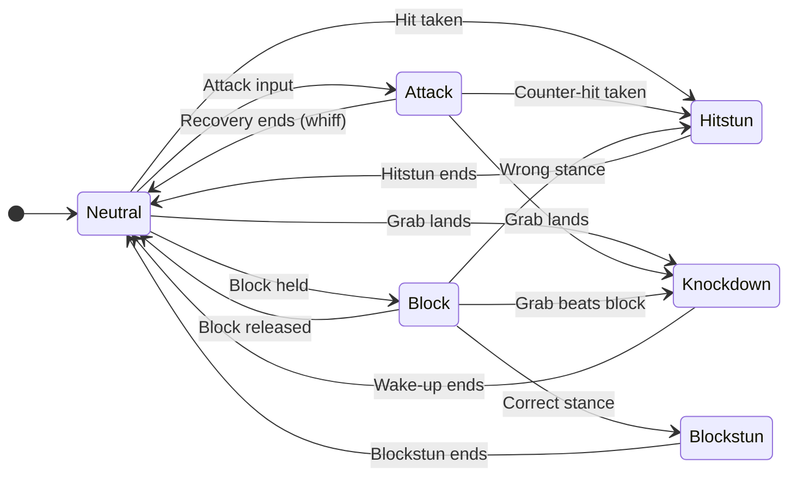
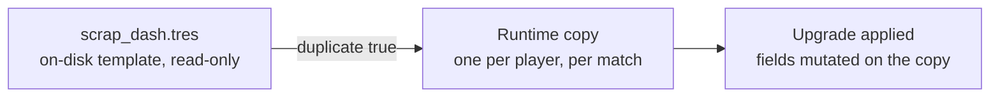
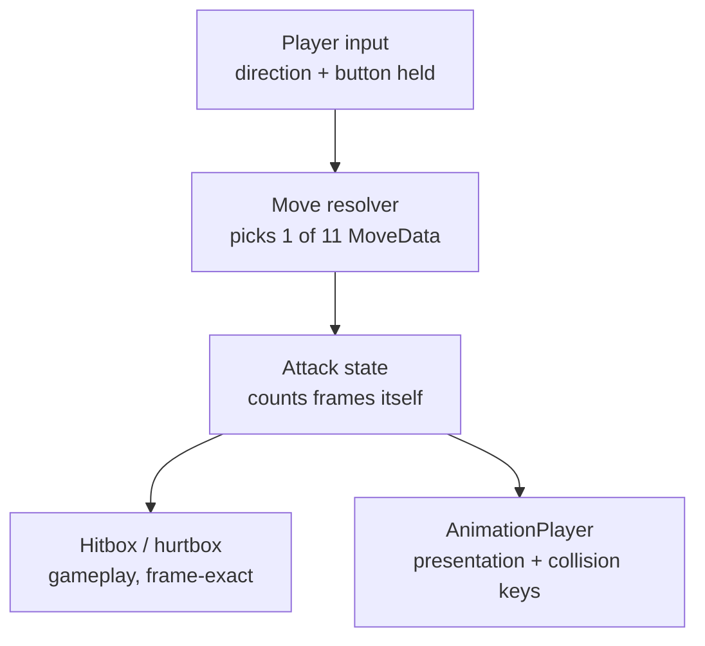
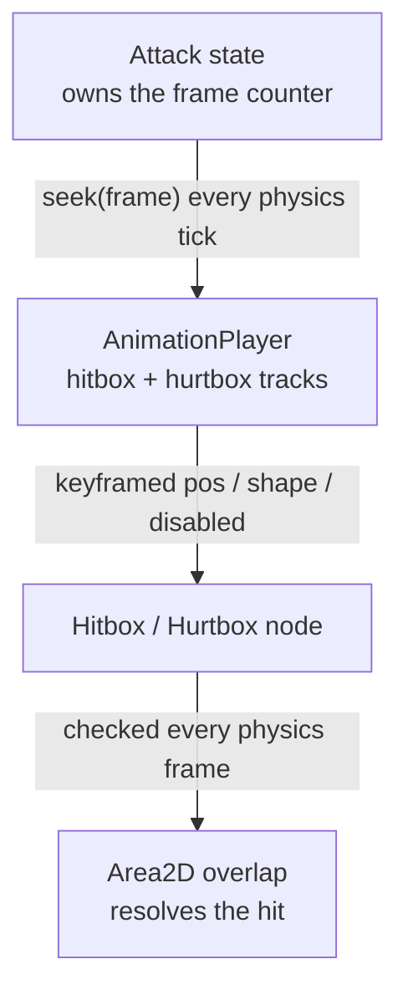
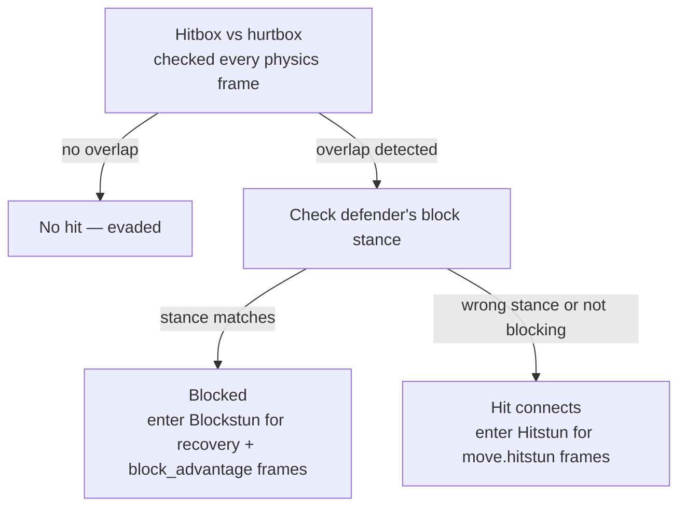
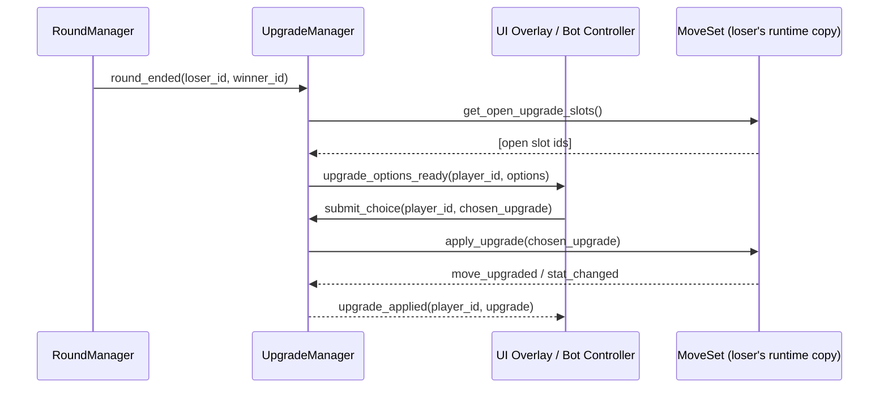

# Fighter Character Architecture

*Technical reference: state machine, move data, and per-frame collision authoring*

## 1. Overview

The fighter runs on a top-level state machine. None of the moves get their own state. One generic Attack state plays all of them, driven entirely by a MoveData resource. Frame timing (startup/active/recovery) is counted in code, independent of animation playback, so it stays exact regardless of what's on screen. Hitboxes and hurtboxes are authored visually per frame inside each move's own animation, then sampled by the state machine rather than driven by animation signals.

Blockstun and hitstun are tracked as separate states with separate durations. Blocking a hit and eating a hit clean recover at different speeds, and combo potential depends on that gap.

## 2. Top-level state machine

A hit lands on the **defender's** state machine, not the attacker's. So any of Neutral, Attack, or Block can be interrupted by an incoming hit, not just Neutral. Grab bypasses the block check entirely and always routes to Knockdown.




**Blockstun vs. Hitstun vs. Knockdown, and why they're separate:**

- **Blockstun**: defender correctly blocked. Duration comes from the move's `block_advantage` relative to the attacker's `recovery` (below). Shorter than hitstun on most moves, which is what lets a blocking defender act again before a punishable attacker does.
- **Hitstun**: defender got hit clean, or blocked in the wrong stance (which counts as a full hit, not a block). Duration is the move's `hitstun` field, independent of `block_advantage`. This is what makes combos/gatlings possible; a move whose `recovery` is shorter than the opponent's `hitstun` can chain into the next hit.
- **Knockdown**: only reached via Grab (or "certain specials" per the glossary, none currently on the table). Longer than either stun state, and ends with a brief invincible wake-up window rather than dropping straight back to Neutral.

## 3. MoveData resource

Each move is a `.tres` file built from this Resource class, named by its numpad notation (`n5.tres`, `s6.tres`, etc., see GDD §2.1) rather than a flavor name. Filling in the Inspector fields for one move is the entire authoring step; no new code is written per move.

```gdscript
class_name MoveData
extends Resource

enum HitLevel { LOW, MID, OVERHEAD }
enum InputDir { NEUTRAL, FORWARD, BACK, DOWN, UP }
enum Kind { NORMAL, SPECIAL, GRAB }

@export var move_name: String = ""
@export var input_dir: InputDir
@export var kind: Kind
@export var hit_level: HitLevel

@export_group("Frame data")
@export var startup: int
@export var active: int
@export var recovery: int
@export var block_advantage: int      # blockstun = recovery + block_advantage
@export var hitstun: int              # stored directly, not derived
@export var damage: float = 0.0

@export_group("Animation")
@export var animation_name: StringName

@export_group("Special properties")
@export var low_profile: bool = false
@export var is_charge_move: bool = false
@export var charge_frames: int = 0
@export var fires_projectile: bool = false
@export var gatlings_into: Array[StringName] = []

@export_group("Upgrade state")
@export var upgrade_slot_id: StringName = ""
@export var is_unlocked_by_default: bool = true   # false for the 4 lockable specials
@export var is_upgraded: bool = false
@export var upgrade_property_id: StringName = ""
```

### 3.1 Field reference

| Field | Type | Purpose |
|---|---|---|
| `move_name` | String | Display name, matches its numpad notation, e.g. `"s6"` |
| `input_dir` | enum InputDir | NEUTRAL / FORWARD / BACK / DOWN / UP |
| `kind` | enum Kind | NORMAL / SPECIAL / GRAB |
| `hit_level` | enum HitLevel | LOW / MID / OVERHEAD |
| `startup` / `active` / `recovery` | int | Frame counts driving the Attack state's counter |
| `block_advantage` | int | Attacker's frame advantage/disadvantage once a block is confirmed |
| `hitstun` | int | How long the *defender* is stunned on a clean hit; drives Hitstun's own timer and gatling/combo windows |
| `damage` | float | Damage dealt on a clean hit |
| `animation_name` | StringName | Clip the Attack state seeks into for visuals + collision keys |
| `low_profile` | bool | Flags that this move's clip has hurtbox override keyframes |
| `is_charge_move` / `charge_frames` | bool / int | `s4`'s charge behaviour |
| `fires_projectile` | bool | Marks moves that spawn a projectile entity |
| `gatlings_into` | Array[StringName] | Which moves this one can chain into |
| `upgrade_slot_id` | StringName | Which of the 4 lockable special slots (`s6`/`s4`/`s2`/`s8`) this fills; `""` for normals, `s5`, and grab, which are always available and never gated by the Feature system |
| `is_unlocked_by_default` | bool | `true` for the 5 normals, `s5`, and grab. `false` for `s6`/`s4`/`s2`/`s8`, which start locked and are only usable once a Feature pick unlocks them (see §9) |
| `is_upgraded` / `upgrade_property_id` | bool / StringName | Runtime-only property-upgrade state, only meaningful once a special is unlocked |

### 3.2 Example values

| Field | n5.tres | s6.tres |
|---|---|---|
| `move_name` | n5 | s6 |
| `input_dir` | NEUTRAL | FORWARD |
| `kind` | NORMAL | SPECIAL |
| `hit_level` | MID | MID |
| `startup / active / recovery` | 5 / 3 / 10 | 10 / 12 / 16 |
| `block_advantage` | -2 | -6 |
| `hitstun` | 12 | 22 |
| `low_profile` | false | true |
| `is_unlocked_by_default` | true | false |
| `upgrade_slot_id` | `""` | `"s6"` |

`n5`'s `hitstun` (12) comfortably outlasts its own `recovery` (10), which is what lets it gatling into itself. `s6`'s much longer `hitstun` (22) against a 16-frame `recovery` is what makes it a real combo starter rather than just a poke, once a player has unlocked it.

## 4. Runtime duplication for upgrades

The `.tres` files on disk are read-only templates. Mutating one directly (e.g. `move_data.startup -= 3` on a loaded resource) edits the shared object every player and every future match reads from, since Godot resources are references. Instead, `MoveSet` duplicates all 11 base resources into a per-player runtime array at match start, and only that copy is ever mutated by the upgrade system.



`upgrade_slot_id` is what lets the upgrade-roll code stop offering a slot once it's filled: filter the runtime array for moves where `upgrade_slot_id != ""` and `is_upgraded == false` to build the offer pool for that round.

## 5. Data flow: input to screen

How a button press turns into both a visible move and a resolved hit.



## 6. Per-frame collision authoring

Hitboxes and hurtboxes are ordinary nodes (`Area2D` + a unique `CollisionShape2D`) with position, shape, and disabled all keyed directly in each move's own animation — dragged and placed by hand in the 2D viewport while scrubbing frames, the same way any fighting game's hitbox editor works. The Attack state doesn't `play()` that animation; it `seek()`s to its own frame counter every physics tick, so the collision data is sampled in lockstep with the game's own frame-exact timing rather than following the animation player's clock.

```gdscript
func _physics_process(_delta):
    frame += 1
    animation_player.seek(frame / 60.0, true)
    if frame == move.startup + move.active + move.recovery:
        state_machine.transition_to("Neutral")
```



**Key gotcha:** make each hitbox/hurtbox's `RectangleShape2D` unique (right-click → Make Unique) before keying its size — otherwise every instance sharing that resource gets edited at once.

Most moves never touch the hurtbox track at all and simply keep the default standing box inherited from Neutral. Only moves that need it — currently just Scrap Dash — reposition the hurtbox lower in its own animation, so an attack aimed at head/chest height physically stops overlapping it.

- Neutral / Block / Hitstun / Blockstun / Knockdown each reset the hurtbox to its default box and position on `enter()`.
- Attack leaves it alone unless the current move's clip has its own hurtbox keyframes.
- Knockdown additionally disables the hurtbox briefly for the invincible wake-up window called out in the glossary.

## 7. Hit resolution

With the hurtbox physically repositioned per move, evasion falls out of ordinary Area2D geometry — there's no separate "vulnerable levels" system to maintain. If the boxes aren't overlapping, nothing happens. If they are, the only remaining question is whether the defender is blocking in the correct stance — and that answer decides which stun state they land in.



Grab skips this flow entirely — it has no `hit_level`, is proximity-based, and is explicitly unblockable, so it only needs to check whether Attack is currently winning the exchange before sending the defender straight to Knockdown.

## 8. Example node tree

```
Fighter (CharacterBody2D)
├── StateMachine (Node)      # Neutral / Attack / Block / Blockstun / Hitstun / Knockdown
├── MoveResolver (Node)      # direction+button -> which MoveData
├── Hurtbox (Area2D)         # default box, repositioned per move if needed
├── Hitbox (Area2D)          # disabled by default, keyed per move
├── AnimationPlayer          # sprite + hitbox/hurtbox tracks, driven by seek()
└── MoveSet (Node)           # duplicated MoveData array + upgrade state
```

`UpgradeManager` is deliberately **not** in this tree — it's a match-level autoload sitting above both `Fighter` instances, not a child of either. It talks to each `MoveSet` through signals rather than being parented under a fighter. See §9 for the full upgrade system architecture.

## 9. Upgrade system architecture

*Modular by design — the upgrade system knows nothing about input, animation, or which side of the RPS triangle a fighter is on. It only knows about pools, slots, and stats. Everything talks to it through signals, because both fighters run the same code and either one can be bot-controlled — the system can't assume a human is sitting at a UI waiting to click a button.*

### 9.1 Why signals, not direct calls

Two fighters, potentially two AI controllers, one shared upgrade pool. If `UpgradeManager` called into `Fighter` directly (`fighter.moveset.apply_upgrade(...)`) it would need a hard reference to whichever fighter just lost, and the fighter's own scripts would need to know the upgrade system exists at all. Signals invert that: `UpgradeManager` broadcasts "here's what's on offer," and whatever is making the decision for that side — a player's UI overlay, or a bot controller — listens for it and calls back in. Neither side holds a reference to internal state it doesn't own, and swapping a human UI for a bot decision-maker (or running two bots against each other with no UI at all) means connecting a different listener, not touching the upgrade system.

### 9.2 UpgradeData resource

Same pattern as `MoveData` — one Resource class, all authoring happens in the Inspector, zero new code per upgrade.

```gdscript
class_name UpgradeData
extends Resource

enum Category { STAT, SPECIAL_PROPERTY }

@export var upgrade_id: StringName = ""
@export var display_name: String = ""
@export var description: String = ""
@export var category: Category

@export_group("Stat upgrade")            # only read when category == STAT
@export var stat_field: StringName = ""  # e.g. "move_speed", "max_health", "damage_mult"
@export var stat_delta: float = 0.0

@export_group("Special property upgrade") # only read when category == SPECIAL_PROPERTY
@export var target_slot_id: StringName = ""  # matches MoveData.upgrade_slot_id
@export var property_id: StringName = ""     # matches MoveData.upgrade_property_id
```

Stat upgrades are unconstrained and stack indefinitely (§2.2.2 of the GDD). Special property upgrades are constrained to a single slot each and are what the slot-locking rule below is protecting.

### 9.3 UpgradeManager (autoload, one instance for the match)

`UpgradeManager` is global, not per-fighter — there is exactly one pool and one set of rules, shared by both sides. It never touches a `Fighter` node. It only ever talks to a `MoveSet` through its public query/apply methods, and talks to everything else through signals.

```gdscript
class_name UpgradeManager
extends Node

signal upgrade_options_ready(player_id: int, options: Array[UpgradeData])
signal upgrade_applied(player_id: int, upgrade: UpgradeData)

@export var stat_pool: Array[UpgradeData] = []
@export var special_pool: Array[UpgradeData] = []
@export var options_per_round: int = 4

func _ready() -> void:
    RoundManager.round_ended.connect(_on_round_ended)

func _on_round_ended(loser_id: int, _winner_id: int) -> void:
    if loser_id == -1:
        return  # draw — nobody upgrades
    var options := _build_offer_pool(loser_id)
    upgrade_options_ready.emit(loser_id, options)

func _build_offer_pool(player_id: int) -> Array[UpgradeData]:
    var moveset: MoveSet = PlayerRegistry.get_moveset(player_id)
    var open_slots := moveset.get_open_upgrade_slots()

    var special_candidates := special_pool.filter(
        func(u): return u.target_slot_id in open_slots
    )
    var pool := stat_pool + special_candidates   # fallback: if special_candidates
                                                  # is empty (all 5 slots filled),
                                                  # this is just stat_pool — GDD §2.2.2
    pool.shuffle()
    return pool.slice(0, min(options_per_round, pool.size()))

# Called by whichever listener made the pick — UI overlay or bot controller.
func submit_choice(player_id: int, upgrade: UpgradeData) -> void:
    var moveset: MoveSet = PlayerRegistry.get_moveset(player_id)
    moveset.apply_upgrade(upgrade)
    upgrade_applied.emit(player_id, upgrade)
```

`_build_offer_pool` is the only place the slot-locking rule (§2.2.2) and its fallback live. It asks `MoveSet` a single read-only question — which slots are open — and never mutates anything itself.

### 9.4 MoveSet: query + apply, nothing else

`MoveSet` (already introduced in §4 as the holder of the per-player runtime move copies) grows two responsibilities: answering "which slots are free" and mutating its own runtime copies when told to. It doesn't know `UpgradeManager` exists — it just exposes a small public surface and emits signals when something on it changes, so animation/UI/HUD code can react without either side depending on the other.

```gdscript
class_name MoveSet
extends Node

signal move_upgraded(move: MoveData, upgrade: UpgradeData)
signal stat_changed(stat_field: StringName, new_value: float)

var moves: Array[MoveData] = []       # duplicated runtime copies, see §4
var stats: Dictionary = {}            # runtime stat block, duplicated at match start

func get_open_upgrade_slots() -> Array[StringName]:
    var open: Array[StringName] = []
    for m in moves:
        if m.upgrade_slot_id != "" and not m.is_upgraded:
            open.append(m.upgrade_slot_id)
    return open

func apply_upgrade(upgrade: UpgradeData) -> void:
    match upgrade.category:
        UpgradeData.Category.STAT:
            _apply_stat(upgrade)
        UpgradeData.Category.SPECIAL_PROPERTY:
            _apply_special(upgrade)

func _apply_stat(upgrade: UpgradeData) -> void:
    stats[upgrade.stat_field] = stats.get(upgrade.stat_field, 0.0) + upgrade.stat_delta
    stat_changed.emit(upgrade.stat_field, stats[upgrade.stat_field])

func _apply_special(upgrade: UpgradeData) -> void:
    for m in moves:
        if m.upgrade_slot_id == upgrade.target_slot_id:
            m.is_upgraded = true
            m.upgrade_property_id = upgrade.property_id
            move_upgraded.emit(m, upgrade)
            return
```

`_apply_special` mutates the runtime duplicate directly (the same object the Attack state already reads `hitstun`/`recovery`/etc. from in §3), so an upgraded move takes effect on its next use with no extra plumbing — the property itself (e.g. Scrap Dash gaining a bounce, Junk Ball gaining a split-shot) is read by name via `upgrade_property_id` wherever that move's special-case behaviour lives.

### 9.5 Signal flow end to end



Two things fall out of this shape for free:

- **Bot vs. bot works with zero changes.** A bot controller connects to `upgrade_options_ready` exactly like the UI overlay does, runs its own pick logic, and calls `submit_choice`. `UpgradeManager` and `MoveSet` never know whether a human or a bot made the call.
- **The two fighters can't see each other's offers.** Each `upgrade_options_ready` emission carries a `player_id` and only that player's listener acts on it (GDD §2.2.2 — "the winning player never sees the loser's options"). This falls out of listeners filtering on `player_id`, not out of any secrecy mechanism in `UpgradeManager` itself, so it's worth enforcing explicitly in whatever listens (check `player_id` before showing anything).

### 9.6 Quick reference — upgrade system

- One `UpgradeManager` autoload for the whole match — not per-fighter, not per-round.
- `UpgradeData` is a Resource, same authoring pattern as `MoveData` — no new code per upgrade.
- Slot-locking and its stat-only fallback live in exactly one place: `UpgradeManager._build_offer_pool`.
- `MoveSet` exposes a read query (`get_open_upgrade_slots`) and a single mutator (`apply_upgrade`); it has no knowledge of `UpgradeManager`.
- All cross-system communication is signal-based (`round_ended`, `upgrade_options_ready`, `move_upgraded`, `stat_changed`, `upgrade_applied`) — nothing holds a direct reference to a specific fighter's internals.
- Because the offer/pick handshake is signal-driven, a bot controller is a drop-in listener replacement for the UI — the system has no concept of "the player" beyond a `player_id` int.

## 10. Quick reference

- One Attack state for all 11 moves — differences live in MoveData, not code.
- Frame timing is counted by the state machine, never inferred from animation length or signals.
- Hitbox/hurtbox position, shape, and enabled state are keyframed per move and sampled with `seek()`, not `play()`.
- Hurtboxes default to the standing box everywhere except moves that explicitly reposition them.
- **Blockstun and Hitstun are separate states with separate durations** — `block_advantage` (relative to attacker recovery) drives one, `hitstun` drives the other.
- Knockdown is its own state, reached only via Grab, ending in a brief invincible wake-up rather than a plain return to Neutral.
- `.tres` files are read-only templates; only duplicated runtime copies are mutated by upgrades.
