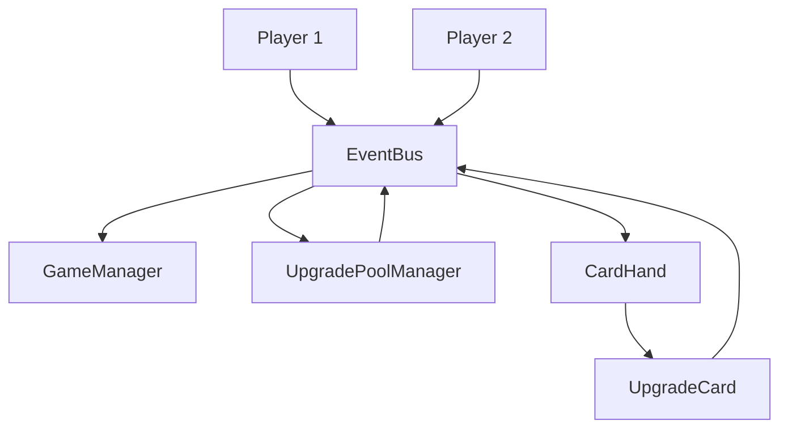
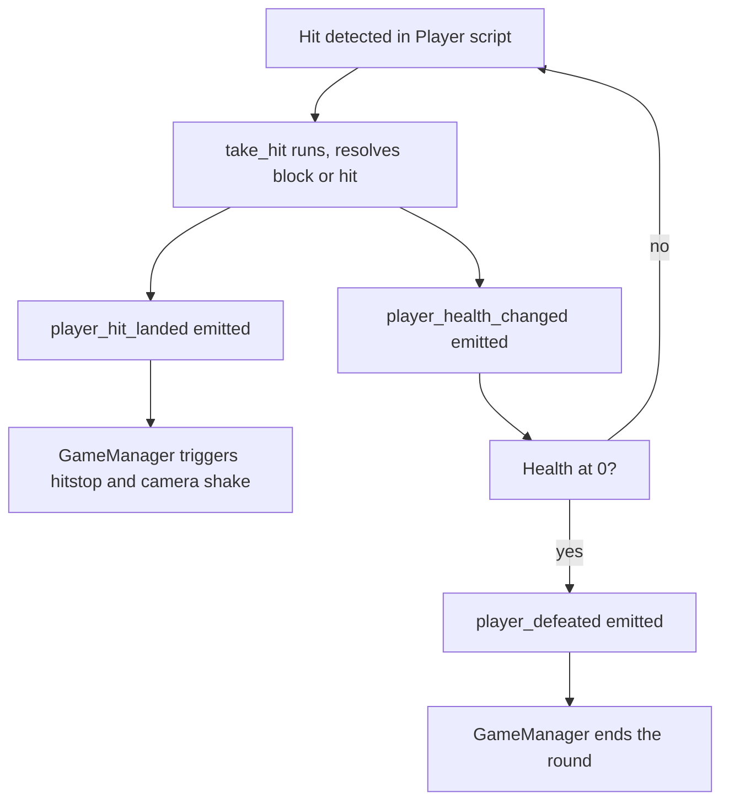
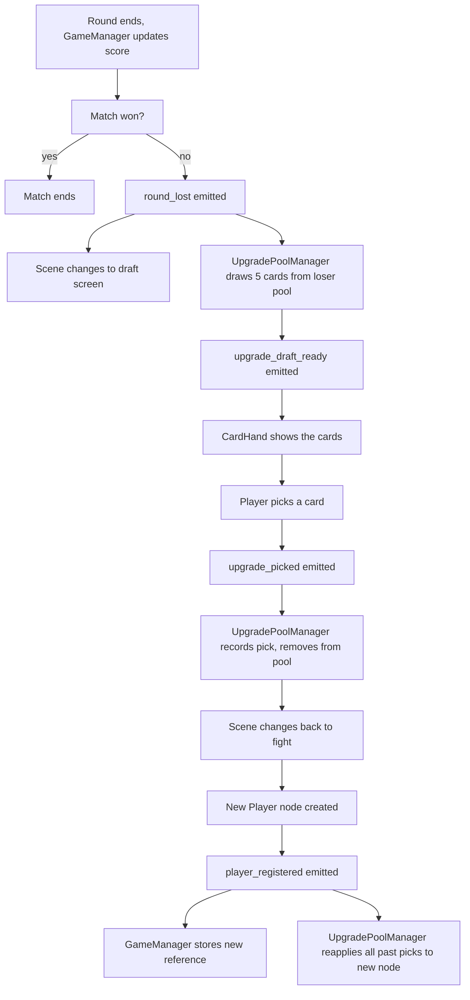

# How The Scripts Talk To Each Other

Core idea: almost nothing calls another script directly. Everything routes through one central hub, `EventBus`. Three scripts are autoloads (singletons that never get destroyed): `EventBus`, `GameManager`, `UpgradePoolManager`. Everything else (Players, the draft UI) gets destroyed and recreated constantly.

## The pieces

- **Player** (testplayer1.gd): the actual fighter. Reads its own input, tracks its own health, decides for itself if it got hit. Two instances exist at once.
- **MoveData**: not a node, just a data container for one attack's numbers (damage, startup, knockback, etc). Each Player duplicates its own copies on ready.
- **EventBus** (autoload): defines signals and a few shared dictionaries. No game logic lives here, it's just the switchboard.
- **GameManager** (autoload): keeps score, decides when a round/match ends, holds live references to both current Player nodes.
- **UpgradePoolManager** (autoload): owns the upgrade card pools, tracks what each player has picked, is the only place upgrades get applied to a Player.
- **CardHand**: the draft screen UI, lives in a separate scene.
- **upgrade_card.gd**: one card in that hand, handles its own visuals and reports a pick.

## Why the middleman

- The fight scene gets fully torn down and rebuilt every round.
- New Player nodes are created from scratch each time.
- Direct references (one script holding a pointer to another node) would go stale and crash the moment that node gets deleted.
- Instead, a fresh Player just announces itself when it's created, and the autoloads listen for that.
- This is the `player_registered` signal, it's the key mechanic the whole system leans on.

Note: EventBus, GameManager, and UpgradePoolManager never get destroyed. Player, CardHand, and UpgradeCard do, every round.

## Combat loop, step by step

- Attacker's hitbox overlaps defender's hurtbox in `_check_hit()`
- Defender's `take_hit()` runs, decides blocked or not
- Attacker emits `player_hit_landed`
- GameManager hears it, triggers camera shake and hitstop (freeze frame)
- Defender's health drops, emits `player_health_changed` (anything showing a health bar can listen)
- If health hits 0, defender emits `player_defeated`
- GameManager hears that and starts ending the round

Player never calls GameManager directly, and GameManager never calls Player directly. Player just emits signals. If GameManager didn't exist, nothing would break, the signals would just go unheard.

## Round loss to new round, step by step

- GameManager's `_end_round()` runs, updates the score, emits `round_won`
- If the winner hasn't won the match yet, GameManager emits `round_lost(loser_id)`
- GameManager also swaps the scene to the card draft screen
- UpgradePoolManager hears `round_lost`, draws 5 random cards from that specific player's remaining pool (not the shared master list)
- UpgradePoolManager saves this draw as `last_offer`, as a backup in case the draft UI loads after the signal already fired
- UpgradePoolManager emits `upgrade_draft_ready` with the 5 cards
- CardHand picks this up (live, or from `last_offer` if it missed the signal) and shows the cards
- Player picks a card, upgrade_card.gd emits `upgrade_picked`
- UpgradePoolManager hears it, records the pick, removes it from that player's pool
- Scene changes back to the fight, a brand new Player node is created
- New Player's `_ready()` emits `player_registered`
- GameManager hears it, stores the live reference
- UpgradePoolManager also hears it, and replays every upgrade that player has picked so far this match onto the new node

Important detail: upgrades are not applied the moment a card is picked. If they were, they'd be applied to the old Player node, the one that's about to get deleted. Instead the pick just gets written down. Then when the new Player node is born and fires `player_registered`, UpgradePoolManager replays that player's entire pick history for the match onto it. If a player has picked 3 upgrades so far, all 3 get reapplied every single round.

This is also why Player duplicates its own MoveData resources on ready. Without that, both Players would share the exact same MoveData objects loaded from disk, and upgrading Player 1's move would silently upgrade Player 2's identical move too.

## Where each piece of data actually lives

**EventBus, live per-frame snapshot:**
- `player_position`, `player_velocity`, `player_is_airborne`, `player_state`, `player_crouching`, `player_blocking_low`
- All keyed by player_id, overwritten every physics frame by each Player
- Exists so things like the camera or UI can check "where is Player 2 right now" without holding a direct node reference

**GameManager, match progress:**
- `p1_rounds_won` / `p2_rounds_won`: the actual scoreboard
- `p1_node` / `p2_node`: live references to the current Player instances, set via `player_registered`
- This has to live here because FightUI, which normally shows the score, gets destroyed every round. GameManager is the one thing guaranteed to still be alive.

**UpgradePoolManager, the draft state:**
- `card_array`: every upgrade that exists, read once from disk at startup
- `pools`: each player's remaining, not yet picked cards
- `current_upgrades`: each player's picks so far this match, this is the actual save data that has to survive every scene change intact

**Player, its own private stuff, resets every round on purpose:**
- `current_health`
- `all_moves` / `normal_moves` / `special_moves`: rebuilt fresh from this instance's own duplicated MoveData
- `locked_move_names`: which moves aren't unlocked yet

## Node tree, for context

- TestLevel (root)
  - Background layers
  - StaticBody2D (floor)
  - Player (player_id 1)
  - Player2 (player_id 2)
  - FightUI
  - Camera2D
  - Shader/effect layers

Player and Player2 aren't wired to each other in the tree. Each Player finds its opponent at runtime by searching the "players" group, not through an exported node path pointing at the other. Same philosophy as EventBus: don't hard-wire a reference to something that might not exist in the same shape later.

## Summary

- Players announce what happened, they don't call anything directly
- GameManager and UpgradePoolManager are the only things guaranteed to always be listening
- Every time a new Player is born, UpgradePoolManager rebuilds it back up to match everything that player has earned
- Nothing holds a pointer to something that could get deleted out from under it
